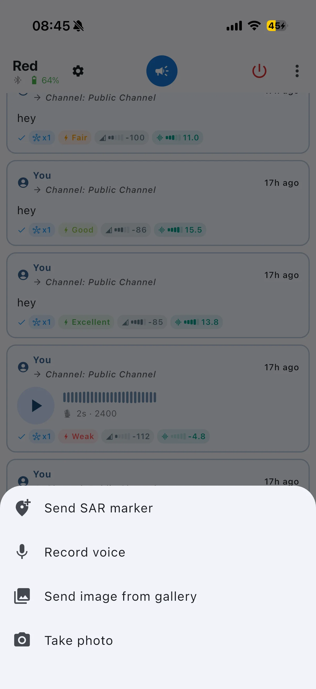
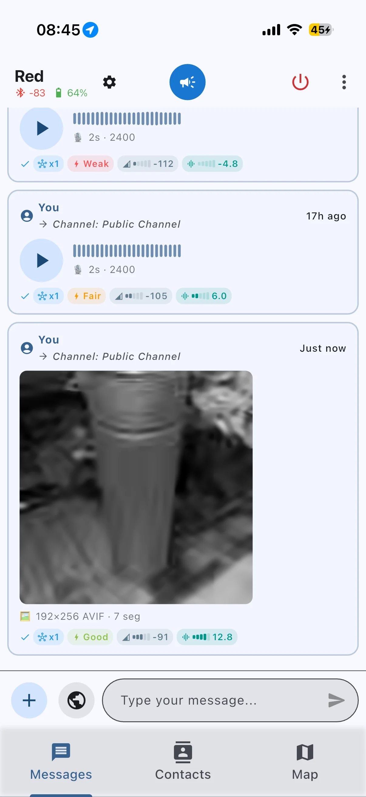
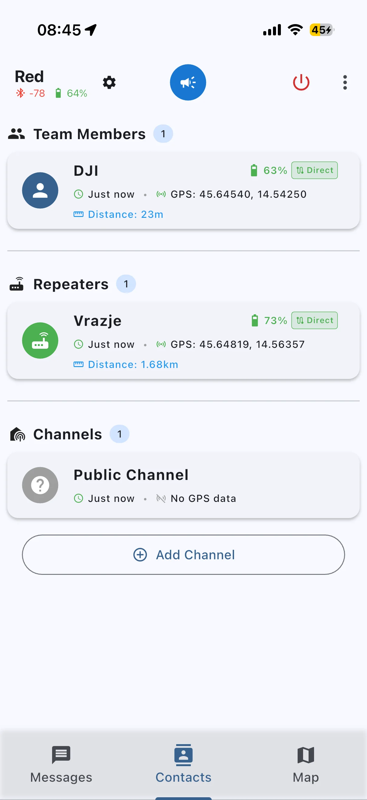
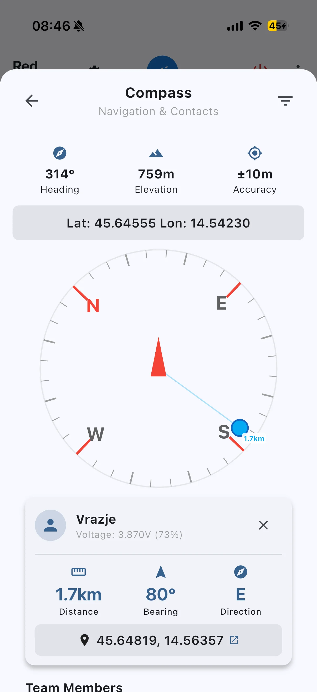
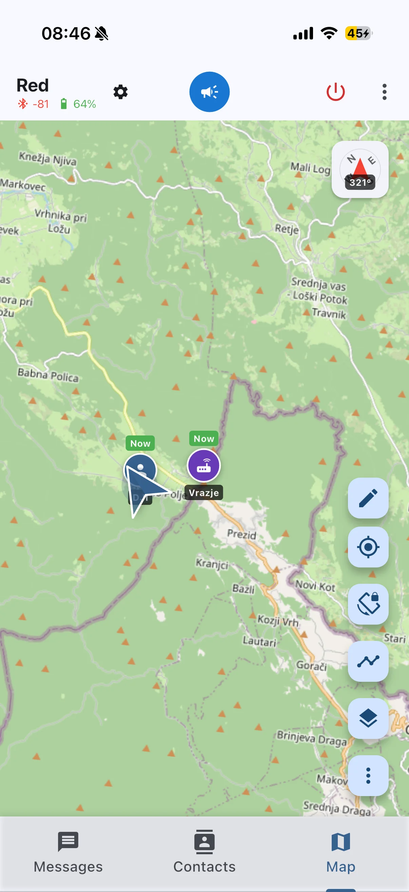

# MeshCore SAR

MeshCore SAR helps teams coordinate in low-connectivity or no-connectivity environments with messaging, voice, images, maps, and live location context in one app. It uses the MeshCore protocol over LoRa for long-range, infrastructure-free communication.

This build is distributed by an independent third party and is not officially affiliated with the upstream MeshCore SAR project.

## Highlights

- **Rapid Mesh Chat**: Direct 1:1 and group communication over off-grid LoRa mesh networks.
- **On-Demand Voice**: Push-to-talk voice clips (Codec2) tuned for low-bandwidth links to minimize mesh congestion.
- **Low-Bandwidth Image Transfer**: Compressed tactical field photo sending (AVIF) with tap-to-load viewing and full-screen inspection.
- **Tactical Offline Maps**: Street, topo, satellite, and terrain layers with offline tile caching and optional MBTiles import.
- **SAR Field Operations**: Real-time team location markers, status freshness indicators, and incident/staging markers.
- **GPS Trails & Navigation**: Continuous position tracking, trail distance/duration metrics, and GPX import/export.
- **Tactical Drawings**: Distance measurement and line/area overlays shared directly to operational channels.

| | |
|---|---|
|  |  |
|  |  |
|  | |

Upstream Source Code Repository: https://github.com/dz0ny/meshcore-sar

<!-- Upstream Source Code Repository: https://github.com/dz0ny/meshcore-sar -->
